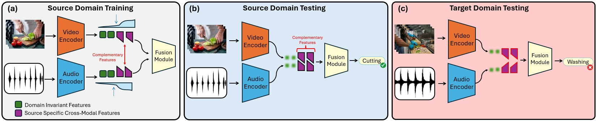

<div align="center">

<h1>MER-DG: Modality-Entropy Regularization for Multimodal Domain Generalization</h1>

<div>
    <a href='https://www.yavuzyarici.com/' target='_blank'>Yavuz Yarici</a>&emsp;
    <a href='https://alregib.ece.gatech.edu/' target='_blank'>Ghassan AlRegib</a>
</div>
<div>
    Georgia Institute of Technology (OLIVES Lab)
</div>

<div align="center">
    <h3>
        <b>Published at ICML 2026</b>
    </h3>
    <p>
        [<a href="https://arxiv.org/abs/2605.01967" target='_blank'><b>Read the Paper Here</b></a>]
    </p>
</div>

<div style="text-align:center">

</div>

---

</div>

**Abstract**

Deploying multimodal models in real-world scenarios requires generalization to new environments where recording conditions differ from training, a challenge known as multimodal domain generalization (MMDG). Standard architectures employ separate encoders for each modality and a fusion module, training the system end-to-end by optimizing on the fused features. In this paper, we identify that such joint optimization causes encoders to exploit cross-modal co-occurrences, statistical relationships between modalities that arise from source-specific recording conditions, rather than learning domain-invariant features. We term this failure mode Fusion Overfitting. To address this, we propose Modality-Entropy Regularization for Domain Generalization (MER-DG), which maximizes the entropy of each encoder's feature distribution to preserve feature diversity. MER-DG is architecture-agnostic and integrates into existing multimodal frameworks as an additive loss term. Extensive experiments on EPIC-Kitchens and HAC benchmarks demonstrate average improvements of approximately 5% over standard fusion and approximately 2% over state-of-the-art methods.


## Code
The code was tested using `Python 3.10.4`, `torch 1.11.0+cu113`.

Environments:
```
mmcv-full 1.2.7
mmaction2 0.13.0
```

### EPIC-Kitchens & HAC Datasets Preparation

#### Download Pretrained Weights
1. Download Audio model [link](http://www.robots.ox.ac.uk/~vgg/data/vggsound/models/H.pth.tar), rename it as `vggsound_avgpool.pth.tar` and place under the `EPIC-rgb-flow-audio/pretrained_models` and `HAC-rgb-flow-audio/pretrained_models` directories.
   
2. Download SlowFast model for RGB modality [link](https://download.openmmlab.com/mmaction/recognition/slowfast/slowfast_r101_8x8x1_256e_kinetics400_rgb/slowfast_r101_8x8x1_256e_kinetics400_rgb_20210218-0dd54025.pth) and place under the `pretrained_models` directories.
   
3. Download SlowOnly model for Flow modality [link](https://download.openmmlab.com/mmaction/recognition/slowonly/slowonly_r50_8x8x1_256e_kinetics400_flow/slowonly_r50_8x8x1_256e_kinetics400_flow_20200704-6b384243.pth) and place under the `pretrained_models` directories.

#### Download Datasets
- **EPIC-Kitchens**: Download Audio files [EPIC-KITCHENS-audio.zip](https://huggingface.co/datasets/hdong51/Human-Animal-Cartoon/blob/main/EPIC-KITCHENS-audio.zip). Follow the original EPIC-Kitchens extraction format.
- **HAC**: Download at [link](https://huggingface.co/datasets/hdong51/Human-Animal-Cartoon/tree/main).

*(See the original [SimMMDG repository](https://github.com/donghao51/SimMMDG) for the exact desired directory tree structures for the datasets).*

---

## Running the Code (Experiments)

We provide clean compilation scripts for both datasets to run our MER-DG approach alongside the standard Baseline Fusion and the state-of-the-art SimMMDG framework. 

Each directory contains a unified `run_experiments.sh` script that organizes configuring and training the models. Before running:
- Edit `EPIC-rgb-flow-audio/run_experiments.sh` or `HAC-rgb-flow-audio/run_experiments.sh` 
- Point `DATAPATH=` to where you stored the datasets locally.

### EPIC-Kitchens 
```bash
cd EPIC-rgb-flow-audio
bash run_experiments.sh
```

### HAC Dataset
```bash
cd HAC-rgb-flow-audio
bash run_experiments.sh
```

By default, the scripts execute the following experiments sequentially:
1. Baseline Fusion
2. Baseline Fusion + MER-DG
3. SimMMDG Baseline
4. SimMMDG + MER-DG

Modify the script to isolate specific experiments. Ensure `wandb` is configured for metric logging.

---

## Citation


```bibtex
@inproceedings{yarici2026merdg,
    title={MER-DG: Modality-Entropy Regularization for Multimodal Domain Generalization},
    author={Yarici, Yavuz and AlRegib, Ghassan},
    booktitle={2026 International Conference on Machine Learning (ICML)},
    note={Accepted on April 30, 2026},
    year={2026}
}
```


## Acknowledgement
This codebase is adapted from the  **[SimMMDG framework](https://github.com/donghao51/SimMMDG)**. We sincerely thank the authors for open-sourcing their code.
